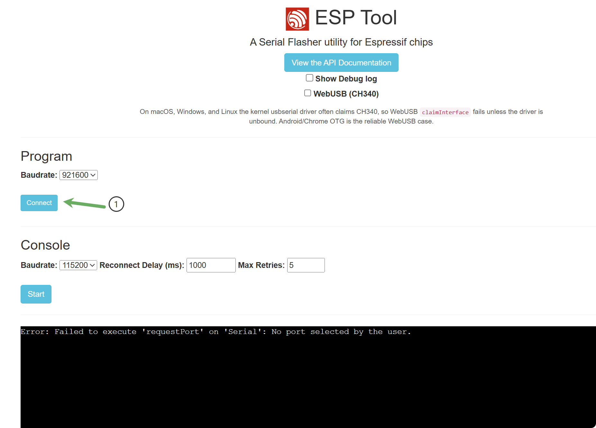
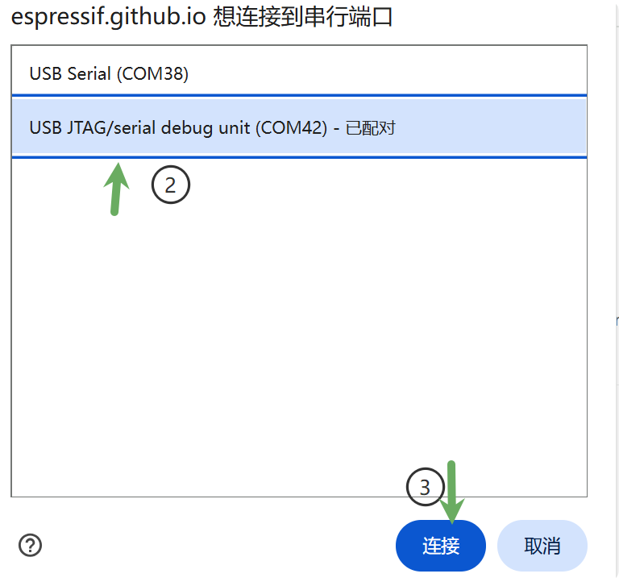
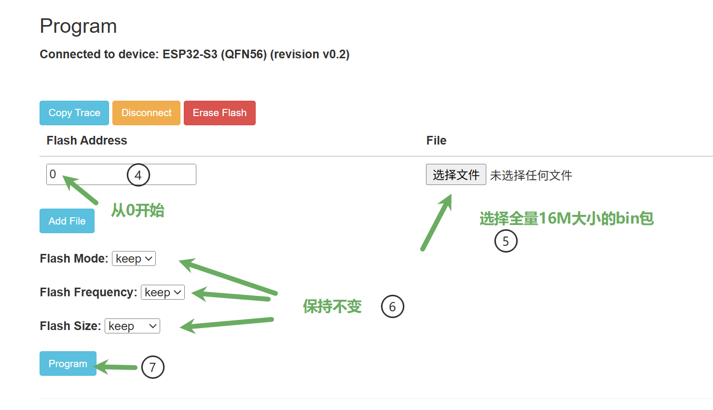

<div align="center">

# XiaoTai ESP32

[简体中文](README.md) | **English**

**Real-time audio, video, and AI voice chat on ESP32**

[](LICENSE)
[](lckfb-szpi-esp32s3-tirtc/README.md)
[](waveshare-esp32p4-xiaotai/README.md)
[](https://github.com/espressif/esp-idf/releases/tag/v5.5.4)
[](https://github.com/tangeai/xiaotai-esp32)
[](https://github.com/tangeai/xiaotai-esp32/issues)

[](lckfb-szpi-esp32s3-tirtc/third_party/tirtc/README.md)
[](lckfb-szpi-esp32s3-tirtc/ARCHITECTURE.md)
[](lckfb-szpi-esp32s3-tirtc/dependencies.lock)
[](lckfb-szpi-esp32s3-tirtc/ARCHITECTURE.md#音频经过哪些节点)
[](lckfb-szpi-esp32s3-tirtc/components/platform_client/src/platform_client.c)
[](#wechat-calls)

[Download firmware](#download-firmware) · [S3 changelog](https://github.com/tangeai/xiaotai-esp32/releases?q=esp32-s3-app-v) · [P4 changelog](waveshare-esp32p4-xiaotai/CHANGELOG.md) · [Browser flasher](https://espressif.github.io/esptool-js/) · [Demo platform](https://xiaotai.chat/) · [Server & mini program](https://github.com/tangeai/tirtc-server-example)

</div>

XiaoTai uses TiRTC/WebRTC for live monitoring, WeChat calls, device-to-device calls, group voice chat, and AI voice chat. Download the firmware for your board, flash it, connect to Wi-Fi, and bind it to your account. No compilation or self-hosted server is required.

**Download BIN → Flash over USB → Connect to Wi-Fi → Bind on the website → Try the features**

<a id="download-firmware"></a>

## Step 1: Download the firmware

Prepare a supported board, a USB data cable, a computer, and a **2.4 GHz Wi-Fi** network with internet access. You will also need an email address to register on the platform.

| Board | Full BIN download (16 MB) | Features |
| --- | --- | --- |
| LCKFB Shizhanpai (立创·实战派) ESP32-S3 V1.0.1/N16R8 | [Download S3 1.4.0](https://github.com/tangeai/xiaotai-esp32/releases/download/esp32-s3-app-v1.4.0/xiaotai-esp32-s3-app-v1.4.0-full-16MB.bin) | Voice calls, AI voice chat, and browser camera viewing |
| Waveshare ESP32-P4-WIFI6-Touch-LCD-3.5 | [Download P4 1.5.0](https://github.com/tangeai/xiaotai-esp32/releases/download/esp32-p4-app-v1.5.0/xiaotai-esp32-p4-app-v1.5.0-full-16MB.bin) | Audio/video calls, live video, and AI voice chat |

Chip requirements: **S3 rev 0.0–0.99; ESP32-P4 rev3.2 or later**. Choose the matching firmware. If the flasher reports an incompatible chip, stop rather than bypassing the check.

These are **pre-release** images. The **Assets** section of each [S3 release](https://github.com/tangeai/xiaotai-esp32/releases/tag/esp32-s3-app-v1.4.0) or [P4 release](https://github.com/tangeai/xiaotai-esp32/releases/tag/esp32-p4-app-v1.5.0) also includes `FLASHING_CN.md`, `SHA256SUMS.txt`, and `release-manifest.json`. The flashing guide is in Chinese. `Source code` is not a flashable image.

<details>
<summary>Verify downloads and view build records</summary>

A full BIN must be **16,777,216 bytes**. Open PowerShell in the download directory to check its size and SHA-256:

```powershell
Get-Item ./*-full-16MB.bin | Select-Object Name, Length
Get-FileHash ./*-full-16MB.bin -Algorithm SHA256
```

Compare the results with `SHA256SUMS.txt` from the same release. On Linux, use `sha256sum -c SHA256SUMS.txt`; on macOS, use `shasum -a 256 -c SHA256SUMS.txt`. Download every file listed in the checksum file first.

`release-manifest.json` records the source, SDK, build configuration, firmware hashes, and validation scope. Build and file checks do not establish target-board media quality or long-term stability. For older firmware, follow its attached board and flashing instructions.

</details>

## Step 2: Flash from your browser

> Flashing a full BIN erases Wi-Fi credentials, binding information, and user settings stored on the device. Back up any settings you need first.

1. Connect the board directly to your computer with a short USB data cable and close any software using its serial port. **For P4, use the main chip's flashing port; the onboard C6 handles wireless connectivity and must not receive this image.**
2. Open the [Espressif browser flasher](https://espressif.github.io/esptool-js/) in **Chrome/Edge**. In the **Program** section, leave Baudrate at `921600`, click **Connect**, and select the board's serial port. **Console** is for serial logs; do not click **Start** while flashing.

   

   The pictured `No port selected` message means port selection was cancelled. Click **Connect** again.

   

   The screenshots show an S3 example. Select your actual device's port; it does not need to be `COM42`.

3. Click **Add File** and add only the `*-full-16MB.bin` for your board. Set **Flash Address to `0x0`** (the pictured `0` is equivalent) and Flash Mode, Flash Frequency, and Flash Size to **`keep`**. There is no need to click **Erase Flash** separately.

   

4. Click **Program** and wait for writing to finish without errors. Then click **Disconnect** and press the board's **RESET/RST** button to restart it.

- **Which serial port?** Unplug and reconnect the board, then select the entry that disappears or appears. Its name may include `USB JTAG/serial debug unit`, `USB Serial`, or `COM…`. Do not select a Bluetooth port.
- **Connection fails?** Check that the cable supports data transfer. Hold **BOOT**, press and release **RESET**, then release BOOT and retry.
- **`Serial data stream stopped`?** Try a short data cable without a hub or extension. If it still fails, disconnect, lower **Program → Baudrate** to `115200`, and reconnect before retrying.

## Step 3: Connect to Wi-Fi

1. Follow the setup instructions on the device screen. Both S3 and P4 support entering Wi-Fi details from your phone through hotspot setup.
2. Connect your phone to the open `XiaoTai-XXXX` hotspot shown on the screen, then visit `http://192.168.6.1`.
3. Select your **2.4 GHz Wi-Fi** network from the list, enter its password, and submit. Saved networks can reuse their passwords; hidden networks can be entered manually. Once connected and synchronized with a time server, the device displays a **6-digit binding code**.

Switch your phone or computer back to a network with internet access before opening the demo platform.

## Step 4: Bind the device on the website

The instructions below include the Chinese interface labels to help you find each control.

1. Open the [XiaoTai demo platform](https://xiaotai.chat/), register, and sign in.
2. Go to [My Devices (我的设备)](https://xiaotai.chat/devices). Select **Add Device (添加设备) → Bind with Code (验证码绑定)**.
3. Enter the **6-digit code** shown on the device and click **Bind Device (绑定设备)**.
4. Return to the device list and check that the device shows **Online (在线)**. If the code has expired, follow the device prompts to get a new one.

## Step 5: Try the features

Live monitoring, WeChat calls, and AI voice chat each require one device. Device-to-device calls require two. Close the live view or end the current call before switching features.

### Live monitoring

1. In the website's device list, click **Live (实时)** for your device.
2. Click the sound button to hear audio from the device. Both S3 and P4 provide live video with their supported cameras connected. S3 uses a GC2145 at 240×176, targeting 12 fps.
3. Allow microphone access in your browser. Press and hold **Hold to Talk (按住说话)** to send your voice to the device.

### WeChat calls

1. Tap **WeChat Call (微信电话)** on the device. If there are no WeChat contacts, the screen displays a mini program QR code.
2. Scan it with WeChat and follow the mini program prompts to authorize voice/video calls from the device.
3. Sync the device's contacts, select an authorized WeChat contact, and start a call. Answer on your phone.

When WeChat contacts are already available, the **WeChat Call** shortcut calls the first WeChat contact in the list. S3 supports voice calls; P4 supports audio/video calls.

### Device-to-device calls

1. Set up the second device using steps 1–4. Devices bound to the same account automatically become contacts.
2. Sync contacts on the device. For devices on different accounts, add the other device through the website's **Contacts (联系人)** page and have the other user accept the request.
3. Select the other device and start a call, then answer on that device. Video calls are available when both devices support video.

### Group voice chat

1. Prepare two or more bound, online devices. Open **Three-dot menu → Group Voice Chat (多人对讲)** and create a room on one device.
2. Join from the other devices using the same six-digit room number. Enter the four-digit password if one is set.
3. Once connected, hold the talk button to speak and release it to listen. Returning to the menu disconnects voice chat but keeps room membership; **Leave Room (退出房间)** removes membership.

This feature requires room support on the platform and uses voice on both S3 and P4. See the [S3 guide](lckfb-szpi-esp32s3-tirtc/docs/GETTING_STARTED_CN.md#多人对讲) or [P4 guide](waveshare-esp32p4-xiaotai/docs/GETTING_STARTED_CN.md#多人对讲) for details.

### AI voice chat

1. End any active call and return to the device's home screen.
2. **Tap the face on the home screen**, or say **“你好小钛” (Nǐ hǎo Xiǎotài)**.
3. Once the device responds, start speaking. For example, say “介绍一下你自己” (“Introduce yourself”).

## Developer resources

The linked development guides are in Chinese.

- **Version changes:** [S3 changelog](https://github.com/tangeai/xiaotai-esp32/releases?q=esp32-s3-app-v) and [P4 changelog](waveshare-esp32p4-xiaotai/CHANGELOG.md), each covering its own features, fixes, and dependency changes by version.
- **Build and configuration:** [S3 guide](lckfb-szpi-esp32s3-tirtc/README.md) and [P4 guide](waveshare-esp32p4-xiaotai/README.md). Builds use ESP-IDF 5.5.4. Each project includes its own code, SDK, model, and resources and can be built independently.
- **Architecture and code:** [S3 communication and audio](lckfb-szpi-esp32s3-tirtc/ARCHITECTURE.md) and [P4 communication, audio, and video](waveshare-esp32p4-xiaotai/docs/P4_MEDIA_ARCHITECTURE.md).
- **Troubleshooting and limitations:** [S3 known issues](lckfb-szpi-esp32s3-tirtc/KNOWN_LIMITATIONS.md) and [P4 troubleshooting](waveshare-esp32p4-xiaotai/docs/TESTING.md).
- **Server, Web, and WeChat mini program:** [tirtc-server-example](https://github.com/tangeai/tirtc-server-example). For self-hosting, see the [deployment guide](https://github.com/tangeai/tirtc-server-example/blob/main/thing-connect/deployment.md).

These evaluation images are for controlled networks; do not use production credentials. Before production integration, review the [S3 network and credential limitations](lckfb-szpi-esp32s3-tirtc/KNOWN_LIMITATIONS.md#网络与凭据) and [P4 service configuration](waveshare-esp32p4-xiaotai/docs/GETTING_STARTED_CN.md#配置服务). Assess transport authentication separately for the SDK, APIs, and MQTT.

## Feedback and license

When [opening an issue](https://github.com/tangeai/xiaotai-esp32/issues), include your board model, firmware version, reproduction steps, and relevant logs. Remove passwords and keys from the logs before sharing.

This project uses the [MIT License](LICENSE). Third-party SDKs and assets retain [their respective licenses](THIRD_PARTY.md).
