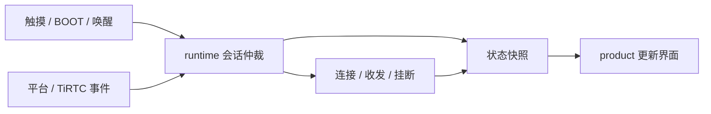

# 架构与代码入口

先按[开发指南](docs/GETTING_STARTED_CN.md)跑通功能，再从下面的表格定位修改位置。本页描述当前 S3 的模块边界和数据流，运行条件见[已知限制](KNOWN_LIMITATIONS.md)。

## 要改什么，去哪里找

以下组件都位于 `components/`。

| 需求 | 主要入口 | 职责 |
| --- | --- | --- |
| 启动、绑定流程 | [main/app_main.c](main/app_main.c) | 初始化、身份检查、异步平台请求 |
| 保存设备身份 | [runtime_config](components/runtime_config/include/runtime_config.h) | 校验并持久化 TiRTC 凭据；不处理 Wi-Fi |
| NVS 执行与异步保存 | [nvs_worker](components/nvs_worker/include/nvs_worker.h) | 持有请求副本，串行执行存储；区分入队、完成与超时 |
| 配网、重连 | [wifi_manager](components/wifi_manager/include/wifi_manager.h) | Wi-Fi 凭据、STA 重连、热点 HTTP/DNS |
| 平台接口、联系人 | [platform_client](components/platform_client/include/platform_client.h) | 服务发现、绑定、MQTT、联系人及呼叫 API |
| SDK 连接与回调 | [starter_tirtc](components/starter_tirtc/include/starter_tirtc.h) | SDK 生命周期、订阅和事件转换 |
| 会话切换、呼叫状态 | [starter_runtime](components/starter_runtime/include/starter_runtime.h) | AI、H5、设备、微信与多人对讲的业务仲裁及状态快照 |
| 多人对讲 | [starter_room.inc](components/starter_runtime/src/starter_room.inc)、[房间页面](components/starter_product/src/starter_product_s3_room.inc) | 房间归属、连接、成员、租约及按住讲话 |
| 采集、AEC、播放 | [starter_media](components/starter_media/include/starter_media.h) | Codec/I2S、AFE、增益、收发与播放队列 |
| 唤醒识别 | [starter_voice](components/starter_voice/include/starter_voice.h) | 音频窗口、模型推理、唤醒意图 |
| 页面、字幕、表情 | [starter_product](components/starter_product/src/starter_product.c) | LCD、触摸、LVGL 对象、背光 |
| BOOT、开发命令 | `starter_button`、`starter_console` | 向 runtime 提交操作；开发控制台默认关闭 |

## 操作如何到达界面



UI 提交意图并显示快照，不在点击回调中等待网络。网络回调需要异步处理数据时，先复制有效载荷，不能保留 SDK 的临时指针。

AI、H5、设备和微信通话共用音频资源。人际通话可抢占 AI/H5；人际通话之间按忙线、接听状态处理。重复挂断需要幂等，同一连接不能由两个退出入口重复释放。

多人对讲同样复用这套 RTC 和音频资源，只在房间页面打开期间连接。返回菜单停止收发、断连并释放租约，保留服务端房间归属；“退出房间”才调用解除归属接口。房间页面不直接操作 SDK，也不创建独立的采集或播放任务。

音频帧携带会话代次（epoch）。静音或切换会话后，消费端丢弃旧代次数据，避免上一通电话的尾音进入下一通。重启后若平台返回 `40202/data.room_id`，按返回房间及当前角色处理遗留业务房间。

## 启动、配网与绑定

```text
NVS 执行器 → 配置加载 → 音频资源就绪 → Wi-Fi / UI
                             ↓
                         联网 → SNTP 校时成功
                                  ├─ 无绑定凭据：发现 / 验证码绑定
                                  └─ 已有绑定凭据：复用本地身份
                                             ↓
                                       TiRTC 就绪
                                             ↓
                                  平台鉴权 / 永久 MQTT
```

两条路径都在本次开机完成一次 SNTP 校时后才初始化 TiRTC。仅系统时间看起来有效，
不代表本次已完成校时。超时或失败时保持云端启动等待并记录错误；校时在常驻的
PSRAM 启动任务执行，不阻塞本地 UI 和音频。后续绑定、鉴权复用已完成的校时结果，
SNTP 在后台定期刷新。TiRTC 的内部连续内存预留保持到校时成功后启动 SDK 时才释放。

采集、AFE 和媒体工作任务常驻。结束通话停止该会话的传输与播放，不反复销毁整个采集链。

NVS 执行器使用 4096 B 内部任务栈，四个请求槽的载荷放在 PSRAM，每槽最多 512 B。同步调用返回完成结果；异步偏好保存只合并同类待处理快照，不覆盖正在写入的数据。入队成功不等于持久化完成，调用超时也不等于已回滚正在执行的写入。

| 网络情况 | 设备行为 |
| --- | --- |
| 没有保存凭据 | 开放热点，停留在配网页 |
| 已保存网络暂时不可用 | 退避重连，间隔上限 30 秒；连续 5 次失败后同时开放热点 |
| 用户主动断开 | 本次开机暂停回连，开放热点；保留凭据供下次启动使用 |
| 已获得 IP | 退出配网 HTTP/DNS/AP，继续平台连接 |

SSID 和密码保存为同一条版本化 NVS 记录。配网页先确认常驻 `wifi_signal` 任务可处理重启，再保存并提交重启通知；浏览器关闭不撤销已接纳的操作。格式迁移和失败语义见[配网兼容说明](KNOWN_LIMITATIONS.md#配网与版本迁移)。

手机配网页位于 [setup.html](components/wifi_manager/web/setup.html)，直接嵌入 Flash，无外部前端依赖。HTTP 只提交扫描意图，由原 Wi-Fi 事件循环执行异步扫描；正在连接时返回忙，不中断 STA。扫描复用重连定时器检查 5 秒超时，完成后继续原定重连。扫描结果最多 24 条，驻留 PSRAM，取出后释放驱动的结果列表。

成功获得 IP 后，NVS 执行器异步更新最近 5 个网络的独立历史。历史工作区 492 B、当前凭据副本 98 B 均放 PSRAM；复用已有 512 B NVS 请求槽和 8192 B PSRAM HTTP 栈，不增加任务。页面只收到名称、信号及已保存标记，`use_saved` 由设备查询历史密码，不把明文历史密码返回开放热点。

绑定提示音与身份状态分开处理。有效绑定确认会取消后续播报；正在下载提示音时，取消检查仍受下载返回时机约束。

## 音频经过哪些节点

```text
ES7210：MIC1 + MIC2 + MIC3 电气回采
  → 重排为 MMR → ESP-SR 双麦 AFE → 单声道 PCM / AGC
  ├─ 16 kHz 唤醒识别
  └─ 8 kHz、20 ms G.711A → TiRTC

TiRTC 下行
  → PSRAM 固定池 → 自适应缓冲 → 解码 / 跨包 PCM
  → 微幅调速 → 有界 I2S 写入 → ES8311 / 扬声器
```

双麦进入算法，唤醒和上行使用处理后的单声道。应用按 SDK 回调顺序消费，不自行实现网络重传或乱序重排。

修改采集、播放或提示音时，重点检查帧连续性、参考信号时序、输出锁和会话代次。参数变更应同时回归 AI、H5、设备、微信及多人对讲。

## 页面与字幕

首页布局位于 [starter_product_s3_ui.inc](components/starter_product/src/starter_product_s3_ui.inc)，表情绘制位于 [starter_product_s3_face.inc](components/starter_product/src/starter_product_s3_face.inc)。

- 同页状态变化更新现有对象，不反复创建整页。
- 文本先按协议合并，再裁成最新两行显示。ASR 快照替换当前话语；TTS 按模式和话语编号合并。
- 图标大小与触摸区域分开设置；音量、挂断等动作通过异步入口处理。
- 表情使用参数化实心图形、缓动和眨眼，保持 RGB565 字节序一致。

表情菜单提供 23 类：“思考”“放松”固定使用第一套姿态及动作，其余 21 类随机二选一，
共 44 个可用姿态及一次性关键帧动作。AI 思考阶段也固定第一套。切换从当前插值位置继续，
音量活动更新不重新抽取姿态或重播动作。动画状态及画布放在 PSRAM，复用一个 40 ms
LVGL 定时器，离开表情页或熄屏时暂停；帧绘制不申请新堆内存。局部刷新覆盖新旧图形范围，
深色镜片和有色装饰按透明度叠加，基础轮廓保持 RGB565 字节序处理。

B 套采用宽厚弯豆/折叠眼、浅波浪嘴及双瓣亲亲嘴，轮廓参数随切换插值；
墨镜、双泪滴、腮红和 zzz 按各自含义绘制；放松的哼歌音符保留第一套。B 套眨眼闭合侧保留 24 像素厚度，
聆听与思考阶段使用阶段自身的轮廓扩展，避免继承上一情绪的折叠眼或嘴形装饰。
局部刷新预留 96 个图形边界槽，覆盖快速切换期间新旧装饰的叠加，仍不逐帧分配内存。
自然眨眼按眼高和折叠强度连续混合，避免切入折叠眼时突然撑开。每次进入新表情重置
该表情的提示动作时钟，即使旧装饰仍在淡出；重复活动更新或保持同一表情的阶段切换不重播。

本地表情类别不等于云端情绪协议。TTS 的 `emotion` 仍按固定字典匹配，
未新增“悲伤”“难过”等中文映射；聆听和思考阶段优先显示阶段提示，保留部分情绪轮廓。

## 构建与资源约束

本工程自带 SDK、模型和资源，不读取其他平台目录。下载依赖按 `dependencies.lock` 锁定。

`cmake/tflm_conv_channels.cmake` 修正锁定 TFLM 版本的卷积通道字段，使 S3 使用预期的加速路径；它会校验源文件哈希，升级依赖时需重新审查。

普通工作池和适合的任务栈使用 PSRAM；DMA、实时控制及 Flash 受限调用保留必要内部 RAM。链接后的 Python 检查会核对部分资源和调用约束，不能代替运行时栈余量与连续通话测试。
